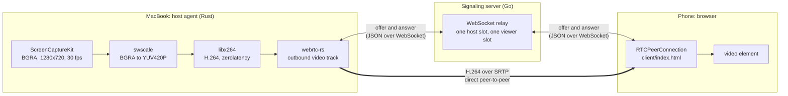
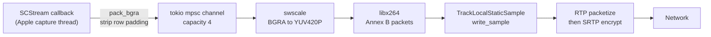
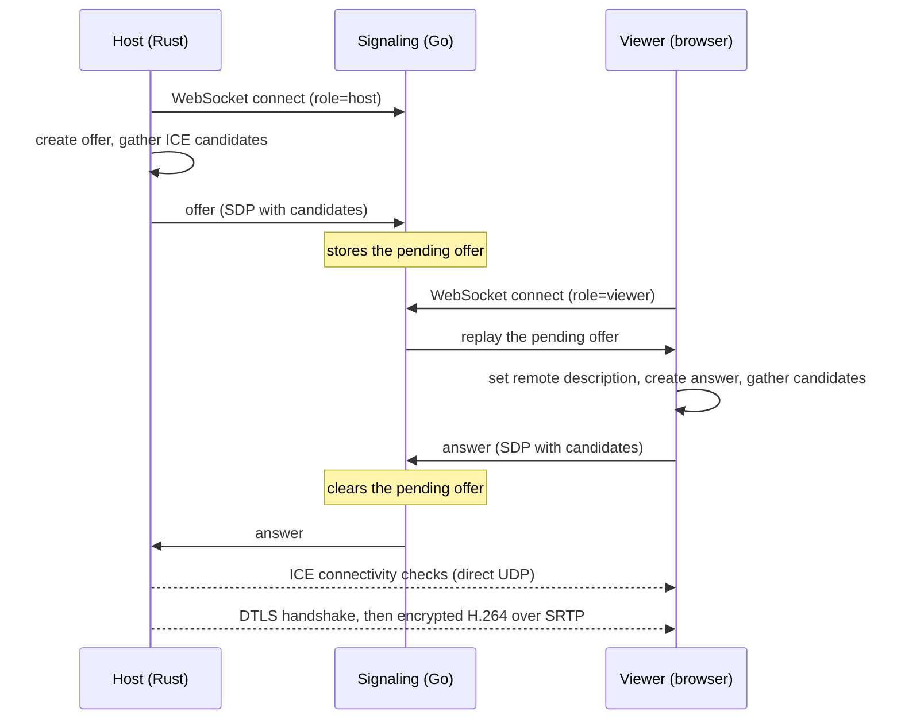
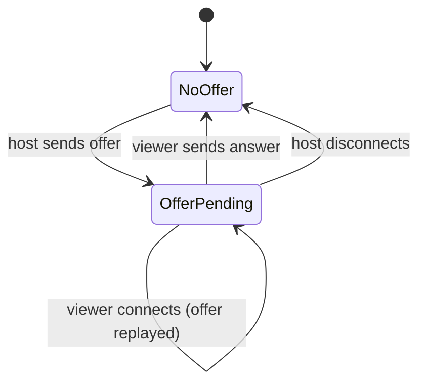

# RemoteBridge

Self-hosted remote desktop. A Rust agent on a MacBook captures the screen,
encodes it to H.264, and streams it over WebRTC to a plain browser page on
a phone. No third-party remote desktop service is involved.


## Current status

| Phase | Scope | State |
|-------|-------|-------|
| v0 | Capture, H.264 encode, write to a local file | Done |
| v1 | Go signaling, WebRTC host, browser client, same LAN | Done |
| v2 | STUN, then self-hosted coturn, so it works across networks | In progress |
| v3 | Input forwarding over data channels, touch mapping | Planned |
| v4 | Signaling tokens, DTLS fingerprint pairing, multi-device | Planned |
| v5 | Native client, Windows and Linux hosts, clipboard, files, multi-monitor | Planned |

**What works today:** the Mac's screen appears in a browser on the same
Wi-Fi network (verified in Safari on iPhone and in a Mac browser). The host
and the viewer can start in either order.

**What does not work yet:** connecting from a different network, controlling
the Mac from the phone, and more than one viewer.

## How it works

Three programs cooperate. The host agent produces video, the browser plays
it, and a small signaling server helps the two find each other. Video never
passes through the signaling server.



### Video pipeline (host)

The capture callback runs on a thread owned by Apple's framework, so it
hands frames to the async side through a bounded channel. If the encoder
falls behind, the channel fills and capture waits, so memory stays flat.



### Connection setup (offer and answer)

Before video can flow, both sides must agree on the codec, how to reach each
other (ICE candidates), and encryption fingerprints. The host writes this
into an SDP text block called the offer. The viewer replies with an answer.
The signaling server only carries these two messages.



If the viewer connects first, the offer is relayed live instead of replayed.
Either order ends the same way.

### Signaling server behavior

The relay is deliberately thin. It reads one field, `type`, so it knows when
an offer is waiting. All other content passes through as opaque bytes.



## Tech stack

| Layer | Choice | Why |
|-------|--------|-----|
| Screen capture | `screencapturekit` crate (ScreenCaptureKit) | Apple's supported capture API, delivers BGRA frames |
| Color conversion | FFmpeg `swscale` via `ffmpeg-next` | libx264 needs planar YUV420P, capture gives BGRA |
| Encoding | libx264, `veryfast`, `zerolatency`, no B-frames, keyframe every 1 s, CRF 23 | Lowest latency; B-frames and lookahead add delay |
| Transport | `webrtc-rs` | Peer-to-peer, built-in encryption (DTLS-SRTP), NAT traversal support |
| Async runtime | `tokio` | Required by `webrtc-rs` and the WebSocket client |
| Signaling client (host) | `tokio-tungstenite`, `serde_json` | JSON messages over WebSocket |
| Signaling server | Go, `gorilla/websocket` | Small relay, also serves the client page |
| Client | Plain HTML and JavaScript, browser `RTCPeerConnection` | Nothing to install on the phone |
| NAT traversal (v2) | Public STUN, then self-hosted coturn | Direct path when possible, relay when not |
| Deploy (planned) | Docker, GitHub Actions, single-node k3s; coturn outside the cluster on host networking | Signaling is stateless HTTP and WebSocket; coturn needs a raw UDP port range |

## Project layout

```
RemoteBridge/
  host/                Rust host agent (macOS)
    src/main.rs          capture handlers, run modes, encode-and-send loop
    src/encoder.rs       H.264 encoder wrapper (YUV420P frames in, Annex B out)
    src/signaling.rs     WebSocket client, Offer and Answer messages
    src/webrtc_host.rs   peer connection, video track, offer/answer handshake
    .cargo/config.toml   Swift library path and rpath (Command Line Tools only)
  signaling/           Go relay and static file server for client/
    main.go
  client/              Browser viewer
    index.html
```

## Running it

### Prerequisites

- macOS with Screen Recording permission granted to your terminal app
- Rust toolchain, Go 1.22 or newer
- FFmpeg libraries with libx264 available to `ffmpeg-next`
- Xcode Command Line Tools. `host/.cargo/config.toml` adds the Swift library
  path the capture crate needs when full Xcode is not installed. Keep it.

### Start the stream

1. Start the signaling server. It must run from `signaling/`, because it
   serves `../client`.
   ```
   cd signaling
   go run .
   ```
2. Open the viewer.
   - On the Mac: `http://localhost:8080`
   - On a phone on the same Wi-Fi: `http://<mac-lan-ip>:8080`
     (find it with `ipconfig getifaddr en0`)
3. Start the host from `host/`. Steps 2 and 3 can be swapped.
   ```
   cd host
   cargo run -- webrtc
   ```

The host prints `peer connection state: connected` once the viewer answers.
Closing the viewer makes the host log `disconnected` and then `failed`. That
is the normal end of a session.

### Host run modes

| Command | What it does |
|---------|--------------|
| `cargo run` | Captures one frame to `frame.png` |
| `cargo run -- gradient` | Encodes synthetic frames to `out.h264` |
| `cargo run -- capture` | Captures 10 seconds of screen to `capture.h264` |
| `cargo run -- webrtc` | Streams the screen to a connected viewer |

## Design decisions

- **Host is the offerer, and the server holds its offer.** The host sends
  one offer at startup. The relay keeps it until a viewer answers, so start
  order does not matter.
- **No trickle ICE.** Each side waits for candidate gathering to finish
  before sending its SDP, so the protocol has two message types instead of
  three. This costs a short delay and is acceptable for now.
- **No B-frames, no lookahead.** Remote desktop is latency-sensitive, so
  compression efficiency is traded for lower delay.
- **Signaling is not part of the media path.** The server can be replaced or
  moved without touching the video pipeline.

## Security

- Media is encrypted end to end by WebRTC (DTLS-SRTP). A relay, when v2 adds
  one, only sees encrypted packets.
- The signaling server has no authentication yet. Anyone who can reach it can
  connect as a viewer and receive the host's offer. Do not expose it publicly
  while the host is running. Signaling tokens and DTLS fingerprint pairing
  are planned for v4. No custom cryptography is used.

## Known limitations

- Same-LAN only: no STUN or TURN, and signaling is reachable only on the LAN.
- The host connects to `ws://localhost:8080`, so it must run on the same
  machine as the signaling server.
- Reloading the viewer after it has connected requires restarting the host.
- View only: no keyboard or mouse input.
- One viewer at a time, main display only, macOS host only.
- No audio and no automatic reconnect.
