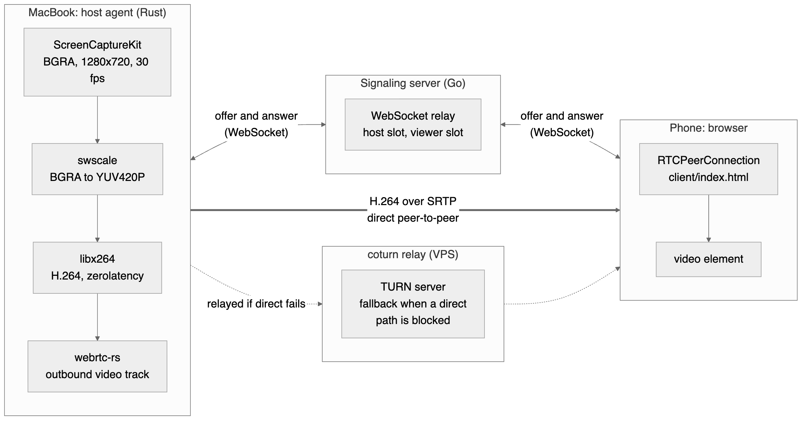
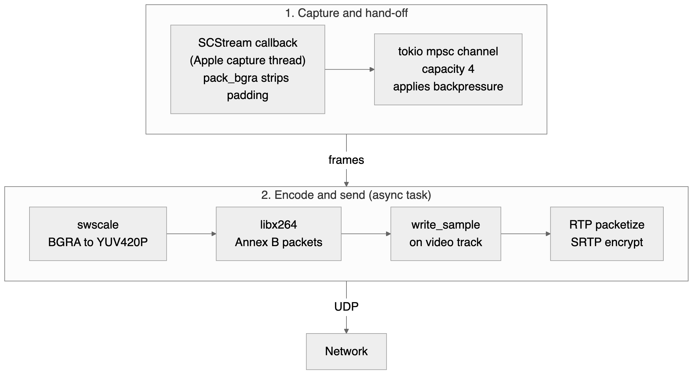
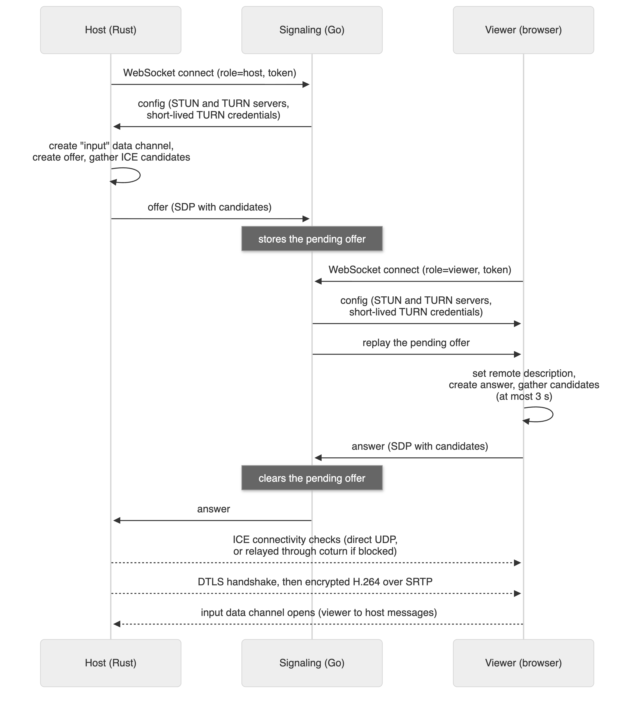
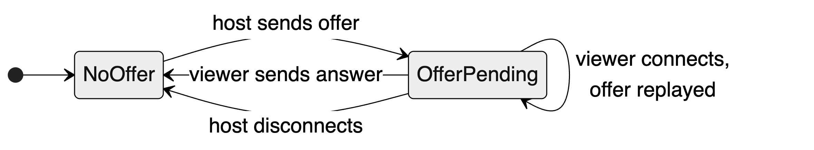

# RemoteBridge

Self-hosted remote desktop. A Rust agent on a MacBook captures the screen,
encodes it to H.264, and streams it over WebRTC to a plain browser page on
a phone. No third-party remote desktop service is involved.


## Current status

| Phase | Scope | State |
|-------|-------|-------|
| v0 | Capture, H.264 encode, write to a local file | Done |
| v1 | Go signaling, WebRTC host, browser client, same LAN | Done |
| v2 | STUN, then self-hosted coturn, so it works across networks | Works phone-on-cellular; campus test pending |
| v3 | Input forwarding over data channels, touch mapping | Planned |
| v4 | Signaling tokens, DTLS fingerprint pairing, multi-device | Planned |
| v5 | Native client, Windows and Linux hosts, clipboard, files, multi-monitor | Planned |

**What works today:** the Mac's screen appears in a browser through a
self-hosted signaling server and coturn relay on a VPS. Verified: a Mac
browser (Chrome or Brave) connecting through the VPS directly, and a
relay-only run that proved the video passes through coturn, and Safari on an
iPhone on cellular streaming from the Mac on home Wi-Fi, in both normal and
relay-only mode. On cellular, ICE picked the TURN relay even in normal mode,
because the carrier's NAT blocked a direct path. The host and the viewer can
start in either order.

**Not yet verified:** the campus Wi-Fi case that motivated v2. Not implemented:
controlling the Mac from the phone, and more than one viewer.

## How it works

Three programs cooperate. The host agent produces video, the browser plays
it, and a small signaling server helps the two find each other. Video never
passes through the signaling server.



### Video pipeline (host)

The capture callback runs on a thread owned by Apple's framework, so it
hands frames to the async side through a bounded channel. If the encoder
falls behind, the channel fills and capture waits, so memory stays flat.



### Connection setup (offer and answer)

Before video can flow, both sides must agree on the codec, how to reach each
other (ICE candidates), and encryption fingerprints. The host writes this
into an SDP text block called the offer. The viewer replies with an answer.
The signaling server only carries these two messages.



If the viewer connects first, the offer is relayed live instead of replayed.
Either order ends the same way.

### Signaling server behavior

The relay is deliberately thin. It reads one field, `type`, so it knows when
an offer is waiting. All other content passes through as opaque bytes.



The diagrams are static images rendered from the Mermaid sources in
`docs/diagrams/`. After editing a `.mmd` file, regenerate the PNGs with
`sh docs/diagrams/render.sh` (needs Node and Chrome).

## Tech stack

| Layer | Choice | Why |
|-------|--------|-----|
| Screen capture | `screencapturekit` crate (ScreenCaptureKit) | Apple's supported capture API, delivers BGRA frames |
| Color conversion | FFmpeg `swscale` via `ffmpeg-next` | libx264 needs planar YUV420P, capture gives BGRA |
| Encoding | libx264, `veryfast`, `zerolatency`, no B-frames, keyframe every 1 s, CRF 23 | Lowest latency; B-frames and lookahead add delay |
| Transport | `webrtc-rs` | Peer-to-peer, built-in encryption (DTLS-SRTP), NAT traversal support |
| Async runtime | `tokio` | Required by `webrtc-rs` and the WebSocket client |
| Signaling client (host) | `tokio-tungstenite`, `serde_json` | JSON messages over WebSocket |
| Signaling server | Go, `gorilla/websocket` | Small relay, also serves the client page |
| Client | Plain HTML and JavaScript, browser `RTCPeerConnection` | Nothing to install on the phone |
| NAT traversal (v2) | Public STUN, plus self-hosted coturn (TURN) with short-lived credentials | Direct path when possible, relay when not |
| Deploy (planned) | Docker, GitHub Actions, single-node k3s; coturn outside the cluster on host networking | Signaling is stateless HTTP and WebSocket; coturn needs a raw UDP port range |

## Project layout

```
RemoteBridge/
  host/                Rust host agent (macOS)
    src/main.rs          capture handlers, run modes, encode-and-send loop
    src/encoder.rs       H.264 encoder wrapper (YUV420P frames in, Annex B out)
    src/signaling.rs     WebSocket client, Offer and Answer messages
    src/webrtc_host.rs   peer connection, video track, offer/answer handshake
    .cargo/config.toml   Swift library path and rpath (Command Line Tools only)
  signaling/           Go relay and static file server for client/
    main.go
  client/              Browser viewer
    index.html
  docs/diagrams/       Diagram sources (.mmd) and the rendered PNGs shown above
  docs/deploy.md       Step-by-step VPS deployment of signaling and coturn
  docs/process-log.md  How the project was built: decisions, detours, mistakes
  docs/debugging-log.md  Problems hit, how each was diagnosed, and the fixes
  deploy/              Example configs: coturn, systemd unit, Caddy
```

## Running it

### Prerequisites

- macOS with Screen Recording permission granted to your terminal app
- Rust toolchain, Go 1.22 or newer
- FFmpeg libraries with libx264 available to `ffmpeg-next`
- Xcode Command Line Tools. `host/.cargo/config.toml` adds the Swift library
  path the capture crate needs when full Xcode is not installed. Keep it.

### Start the stream

1. Start the signaling server. It must run from `signaling/`, because it
   serves `../client`.
   ```
   cd signaling
   go run .
   ```
2. Open the viewer.
   - On the Mac: `http://localhost:8080`
   - On a phone on the same Wi-Fi: `http://<mac-lan-ip>:8080`
     (find it with `ipconfig getifaddr en0`)
3. Start the host from `host/`. Steps 2 and 3 can be swapped.
   ```
   cd host
   cargo run -- webrtc
   ```

The host prints `peer connection state: connected` once the viewer answers.
Closing the viewer makes the host log `disconnected` and then `failed`. That
is the normal end of a session.

### Host run modes

| Command | What it does |
|---------|--------------|
| `cargo run` | Captures one frame to `frame.png` |
| `cargo run -- gradient` | Encodes synthetic frames to `out.h264` |
| `cargo run -- capture` | Captures 10 seconds of screen to `capture.h264` |
| `cargo run -- webrtc` | Streams the screen to a connected viewer |

### Configuration

Everything defaults to a local, unauthenticated setup, so the steps above
work with no configuration. To point at a remote server or require a token:

| Setting | Where | Default | Purpose |
|---------|-------|---------|---------|
| `REMOTEBRIDGE_TOKEN` | Signaling server env | unset (open, with a startup warning) | Shared secret every connection must present |
| `REMOTEBRIDGE_ADDR` | Signaling server env | `:8080` | Address the server listens on |
| `--server` or `REMOTEBRIDGE_SERVER` | Host | `ws://localhost:8080` | Signaling server, `ws://` or `wss://` |
| `--token` or `REMOTEBRIDGE_TOKEN` | Host | none | Token to present (prefer the env var; arguments show up in `ps`) |
| `?token=...` on the page URL | Viewer | none | Token the browser presents |
| `REMOTEBRIDGE_TURN_HOST` | Signaling server env | unset (STUN only) | coturn address, `host:port` |
| `REMOTEBRIDGE_TURN_SECRET` | Signaling server env | unset | Secret shared with coturn; set both TURN variables or neither |
| `--relay` or `REMOTEBRIDGE_FORCE_RELAY=1` | Host | off | Use only TURN-relayed candidates, to prove the relay works |
| `?relay=1` on the page URL | Viewer | off | Same, for the browser |

Tokens may only contain letters, digits, `-` and `_`, for example the output
of `openssl rand -hex 16`.

```
# server
export REMOTEBRIDGE_TOKEN=<secret>
go run .

# host
export REMOTEBRIDGE_TOKEN=<secret>
cargo run -- webrtc --server wss://signal.example.com

# viewer (phone)
https://signal.example.com/?token=<secret>
```

## Design decisions

- **Host is the offerer, and the server holds its offer.** The host sends
  one offer at startup. The relay keeps it until a viewer answers, so start
  order does not matter.
- **No trickle ICE.** Each side waits for candidate gathering to finish
  before sending its SDP, so the protocol has two message types instead of
  three. This costs a short delay and is acceptable for now.
- **No B-frames, no lookahead.** Remote desktop is latency-sensitive, so
  compression efficiency is traded for lower delay.
- **Signaling is not part of the media path.** The server can be replaced or
  moved without touching the video pipeline.
- **A patched copy of `webrtc-dtls` is vendored.** The version `webrtc-rs`
  0.11 depends on picks the first key-exchange curve a browser lists and
  aborts the handshake ("invalid named curve") if it does not support that
  one. Chromium-based browsers list newer curves first, so Chrome and Brave
  could not connect while Safari could. `host/vendor/webrtc-dtls` is that
  exact version with the fix upstream later made (choose the first curve
  both sides support), wired in through `[patch.crates-io]` in
  `host/Cargo.toml`. It should be removed when `webrtc` is upgraded.
- **TURN credentials are minted per connection, not stored in the page.** A
  browser cannot keep a permanent TURN password secret. The signaling server
  signs a username containing an expiry time with a secret it shares with
  coturn (HMAC-SHA1, coturn's `use-auth-secret` scheme) and sends the result
  in a `config` message right after connecting. Leaked credentials stop
  working after 24 hours, and the shared secret never leaves the servers.

## Security

- Media is encrypted end to end by WebRTC (DTLS-SRTP). The TURN relay only
  forwards encrypted packets and cannot see the screen.
- The signaling server accepts a shared token (`REMOTEBRIDGE_TOKEN`) and
  rejects connections without it before they can take a slot. Without a
  token set it is open, and it logs a warning at startup. Do not expose an
  open server publicly while the host is running.
- Over plain `ws://` the token travels in clear text. For a public server,
  put TLS in front of it and use `wss://`; the host supports `wss://`.
- The viewer's token is in the page URL, so it can end up in browser history
  and server logs. This is a stopgap. DTLS fingerprint pairing and
  per-device tokens are planned for v4. No custom cryptography is used.

## Known limitations

- The campus Wi-Fi case has not been tested yet. Networks that block both UDP and TCP on port 3478 would need coturn on
  port 443, which conflicts with Caddy and is not set up.
- The shared token is in the page URL, and the test server is a single Vultr
  instance meant to be destroyed after testing (see `docs/deploy.md`).
- Reloading the viewer after it has connected requires restarting the host.
- View only: no keyboard or mouse input.
- One viewer at a time, main display only, macOS host only.
- No audio and no automatic reconnect.
